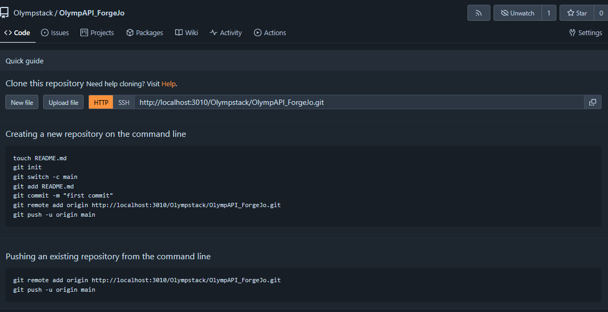
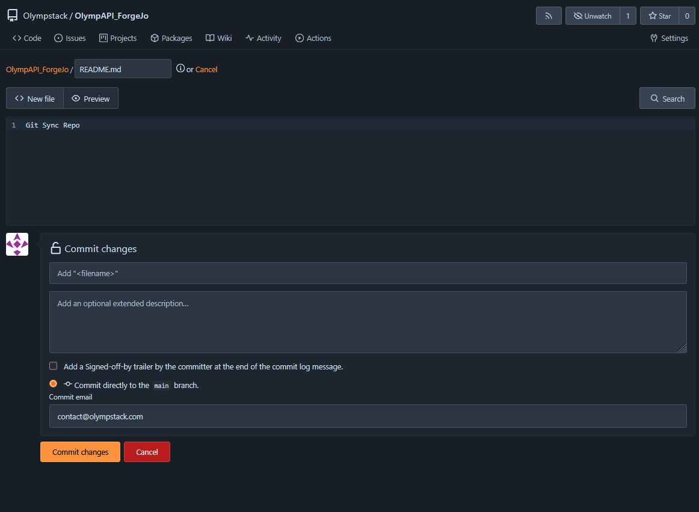
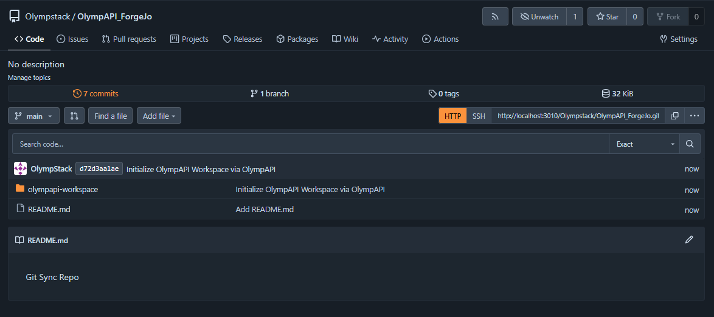
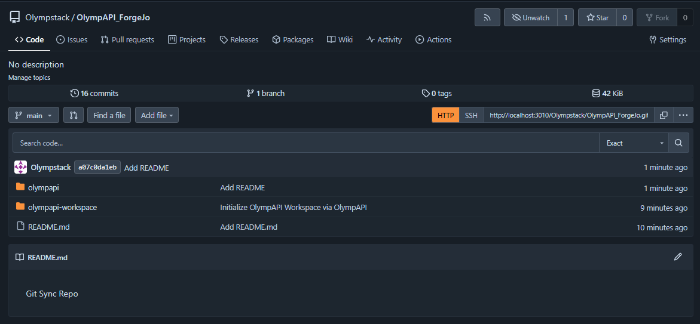
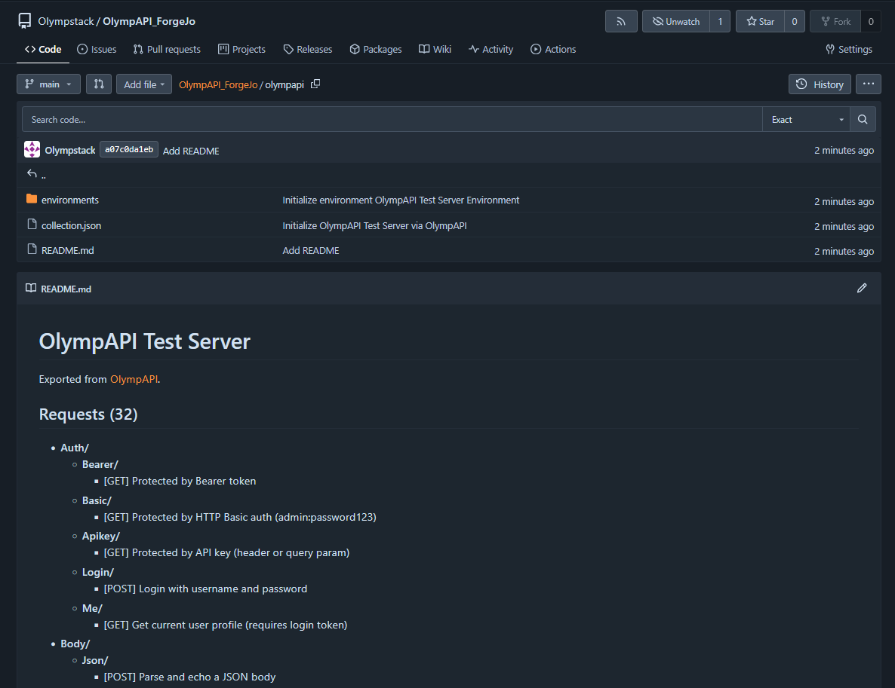
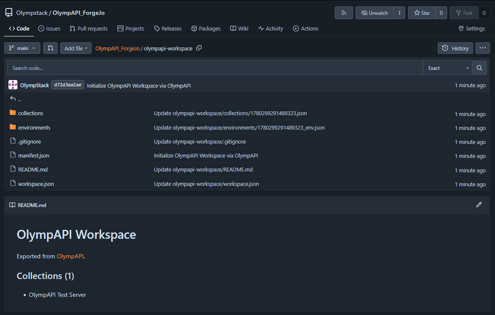

# OlympAPI – User Manual

> **Version:** 1.0.0  
> **Platform:** Windows, Linux  
> **Website:** [olympstack.com/olympapi](https://olympstack.com/olympapi)

---

## Table of Contents

1. [Getting Started](#1-getting-started)
2. [Making HTTP Requests](#2-making-http-requests)
3. [Collections](#3-collections)
4. [Environments & Variables](#4-environments--variables)
5. [Workspaces](#5-workspaces)
6. [Request Tabs](#6-request-tabs)
7. [Importing Collections](#7-importing-collections)
8. [Exporting (Pro)](#8-exporting-pro)
9. [Pre-Request Scripts (Pro)](#9-pre-request-scripts-pro)
10. [Response Tests (Pro)](#10-response-tests-pro)
11. [Request Chaining (Pro)](#11-request-chaining-pro)
12. [Git Sync](#12-git-sync)
13. [Settings](#13-settings)
14. [Keyboard Shortcuts](#14-keyboard-shortcuts)

---

## 1. Getting Started

### Installation

**Windows:** Download the installer (`.exe`) from the releases page and run it. OlympAPI installs to `%LocalAppData%\OlympAPI`.

**Linux:** Download the `.AppImage` or `.deb` package. For AppImage, make it executable: `chmod +x OlympAPI.AppImage && ./OlympAPI.AppImage`.

### First Launch

On first launch, OlympAPI creates a workspace called **"My Workspace"** and opens with an empty request tab.

### License Activation

OlympAPI is free to use with limits. To unlock Pro features:

1. Open **Settings** (top-right gear icon or `Ctrl+,`)
2. Tap **Activation** → enter your Invoice ID and Activation Token
3. Tap **Activate** — the license is verified offline and stored securely

Free plan limits: 3 collections, 3 environments, 1 workspace, 1 Git Sync connection.

### Interface Overview

```
┌─────────────────────────────────────────────────────────────┐
│  OlympAPI                                   [☀] [⚙]         │  ← App Header
├──────────────────────────────────────────────────────────────┤
│  [GET] localhost/api/users ● ✕   [POST] /auth ✕   [+] [▾]   │  ← Tab Bar
├──────────────┬───────────────────────────────────────────────┤
│  Workspace   │                                               │
│  [Selector]  │    URL Bar + Method Selector                  │  ← Request Panel
│  ──────────  │    Headers / Body / Auth / Params             │
│  Collections │    ─────────────────────────────────          │
│  History     │    Response (status, body, headers, timing)   │  ← Response Panel
└──────────────┴───────────────────────────────────────────────┘
```

---

## 2. Making HTTP Requests

### Sending a Request

1. Enter a URL in the URL bar (e.g. `https://api.example.com/users`)
2. Select the HTTP method from the dropdown: `GET`, `POST`, `PUT`, `PATCH`, `DELETE`, `HEAD`, `OPTIONS`
3. Press **Send** (`Ctrl+Enter`)


### URL Bar

Supports environment variables: `{{BASE_URL}}/users/{{USER_ID}}`

### Headers

Click the **Headers** tab. Each header has:
- **Enabled** checkbox (uncheck to send without the header)
- **Name** and **Value** fields

Common headers are added automatically (e.g. `Content-Type: application/json` when using JSON body).

### Query Parameters

Click the **Params** tab. Parameters are appended to the URL automatically: `?key=value&page=1`.

Each param has an **Enabled** checkbox to temporarily exclude it.

### Request Body

Click the **Body** tab and select a type:

| Type | Usage |
|---|---|
| None | GET, HEAD, DELETE |
| JSON | Raw JSON editor with syntax highlighting |
| Form Data | `application/x-www-form-urlencoded` key-value pairs |
| Multipart | `multipart/form-data` with file upload support |
| Raw | Plain text, XML, or custom content types |
| Binary | Upload a file directly as the body |
| GraphQL | GraphQL query + variables editor |

### Authentication

Click the **Auth** tab:

| Type | Fields |
|---|---|
| None | — |
| Bearer Token | Token value (added as `Authorization: Bearer {token}`) |
| Basic Auth | Username + Password (Base64-encoded automatically) |
| API Key | Key name, Key value, Send as Header or Query Param |


### Reading the Response

The response panel shows:
- **Status code** (color-coded: green = 2xx, orange = 3xx/4xx, red = 5xx)
- **Response time** in milliseconds
- **Body** with syntax highlighting (JSON, HTML, XML auto-detected)
- **Headers** tab — all response headers
- **Tests** tab — test results if response tests are configured (Pro)


---

## 3. Collections

Collections are named groups of saved requests, organized in folders.

### Creating a Collection

- Click the **+** icon in the sidebar header, or
- Collections menu (⋮) → **New Collection**


### Adding Requests

Right-click a collection or folder → **New Request**. Give it a name.

The new request opens in a tab. Fill in URL, method, headers, body — then **Save** (`Ctrl+S`) to store it in the collection.

### Folders

Right-click a collection → **New Folder**. Folders can be nested.

### Opening a Request

**Left-click** on a request: opens in the current tab (if the current tab has unsaved changes, a dialog asks whether to Replace or Open in New Tab).

**Right-click** on a request → **Open in New Tab**: always opens in a new tab.

### Renaming, Duplicating, Deleting

Right-click any request or folder to access: **Rename**, **Duplicate**, **Delete**.

### Drag & Drop Reordering

Drag requests and folders within a collection to reorder or move them into a different folder. The drag handle activates immediately (no long press needed).

### Context Menu (Collection Level)

Right-click a collection name or use the ⋮ menu:
- **New Request** — adds a request at the collection root
- **New Folder** — adds a folder at the collection root
- **Rename** — renames the collection
- **Export (Postman)** — exports as Postman Collection v2.1 (Pro)
- **Export (OlympAPI)** — exports in OlympAPI native format (Pro)
- **Git Sync** — opens Git Sync settings for this collection
- **Delete** — permanently deletes the collection and all its contents


---

## 4. Environments & Variables

Environments store key-value pairs that can be substituted into any part of a request.

### Creating an Environment

1. Click the environment selector (top of request panel)
2. **Manage Environments** → **New Environment**
3. Name it (e.g. "Local", "Staging", "Production")
4. Add variables


### Using Variables

Wrap any variable name in double curly braces in URLs, headers, body, or query params:

```
URL:     {{BASE_URL}}/api/users
Header:  Authorization: Bearer {{TOKEN}}
Body:    { "email": "{{USER_EMAIL}}" }
```

### Sensitive Variables

Check the **Sensitive** checkbox for passwords, tokens, and secrets. Sensitive values:
- Are stored in the OS keychain (never in plain JSON files)
- Are **never committed** when using Git Sync (replaced with `{{SECRET - NOT COMMITTED}}`)
- Are displayed as `••••••••` in the UI

### Switching Environments

Use the environment selector dropdown at the top of the request panel. Select **None** to disable variable substitution.


### Variable Resolution Order

1. Active environment variables
2. Variables set by Pre-Request Scripts
3. Variables extracted by Request Chaining rules

---

## 5. Workspaces

Workspaces let you organize collections into separate contexts (e.g. "Work", "Personal", "Client Project").

### Creating a Workspace

Click the workspace selector at the top of the sidebar → **New Workspace** (Pro: unlimited, Free: 1 workspace).


### Switching Workspaces

Click the workspace name in the sidebar → select from the list.

Each workspace maintains its own ordered list of collections. Switching workspaces shows only that workspace's collections.


### Managing Workspaces

In the workspace dialog, right-click or use the ⋮ icon next to a workspace name:
- **Rename** — change the workspace name
- **Delete** — removes the workspace (collections are not deleted, just unlinked)

---

## 6. Request Tabs

OlympAPI supports multiple requests open simultaneously, like a browser.

### Opening Tabs

- **Ctrl+T** — new empty tab
- **Left-click** on a collection request — loads into current tab
- **Right-click** → "Open in New Tab" — always opens a new tab
- History entry tap — opens in a new tab

### Tab State

Each tab independently tracks:
- URL, method, headers, body, auth, params
- Response (last received)
- Dirty state (modified but not saved to collection)

A **dot (●)** on a tab means unsaved changes.

### Switching Tabs

Click any tab to switch to it. The previous tab's state is automatically preserved.

### Closing Tabs

- **Ctrl+W** — close current tab (shows dialog if there are unsaved changes)
- **Alt+Ctrl+W** — force close without dialog
- Click the **✕** on a tab

If the last tab is closed, a new empty tab opens automatically.

### Tab List

**Ctrl+Shift+A** opens the tab overview panel showing all open tabs and recently closed tabs.


---

## 7. Importing Collections

### From OpenAPI / Swagger

1. Sidebar → Import icon
2. Enter a URL (e.g. `https://api.example.com/openapi.json`) and click **Fetch**, or choose a local `.json` / `.yaml` file
3. Toggle **"Categorize by path"** to group requests into folders by URL path segments
4. Preview shows request count → click **Add to Collections**

Supported: OpenAPI 3.x, Swagger 2.x, JSON or YAML format.

**Categorize by path example:**  
`GET /users` and `GET /users/{id}` both land in a folder called `users`.  
`POST /auth/login` lands in a folder called `auth`.


### From Postman

1. Export your Postman collection as **Collection v2.1** (`.json`)
2. Sidebar → Import icon → Choose file
3. OlympAPI auto-detects the Postman format → Preview → Import

### From OlympAPI Native Format

Collections exported from OlympAPI can be re-imported:
1. Sidebar → Import icon → Choose file (`.olympapi.json`)
2. Auto-detected → Preview → Import

### OpenAPI Auto Sync (Pro)

Auto Sync binds a live collection to an OpenAPI/Swagger spec URL. When the spec changes, OlympAPI detects new, modified, or removed endpoints and presents a change review dialog where each change can be applied or skipped individually.

**Setup:**
1. Open a collection → ⋮ menu → **Configure Auto Sync**
2. Enter the OpenAPI/Swagger spec URL
3. Set polling interval (default: on-open)
4. Click **Enable Auto Sync**


**Reviewing Changes:**

When changes are detected, a review dialog lists each endpoint change. Apply or skip each one individually.


---

## 8. Exporting (Pro)

### Export a Collection as OlympAPI JSON

Collection ⋮ menu → **Export (OlympAPI)** → choose save location.

The file includes all requests, folders, and metadata in OlympAPI's native format.

### Export a Collection as Postman JSON

Collection ⋮ menu → **Export (Postman)** → choose save location.

Compatible with Postman Collection v2.1 format for import into Postman or other tools.

### Export a Single Request

Right-click a request → **Export as OlympAPI JSON** → choose save location.

---

## 9. Pre-Request Scripts (Pro)

Pre-request scripts run JavaScript before each request is sent. They can read and modify environment variables and request headers.

### Enabling Scripts

In the request panel, click the **Scripts** tab → enter your script in the **Pre-Request** editor.

### API Reference

```javascript
// Read a variable
const baseUrl = pm.variables.get("BASE_URL");

// Set a variable (in memory for this request)
pm.variables.set("TIMESTAMP", Date.now().toString());

// Read an environment variable
const token = pm.environment.get("TOKEN");

// Set an environment variable (persisted to the active environment)
pm.environment.set("TOKEN", "eyJ...");

// Add a request header
pm.request.headers.add({ key: "X-Request-ID", value: "abc-123" });

// Log to console (visible in script output)
console.log("Script running for: " + pm.variables.get("BASE_URL"));
```

### Execution

The script runs in a QuickJS sandbox. No filesystem access, no network calls. Execution time is limited to 5 seconds.

---

## 10. Response Tests (Pro)

Response tests run automatically after each request and assert conditions on the response.

### Adding Tests

In the request panel, click the **Tests** tab → **Add Test**.

Each test has:
- **Target**: Status Code, Body Contains, Header Value, Response Time (ms)
- **Operator**: equals, not equals, contains, not contains, greater than, less than
- **Expected value**


### Examples

| Target | Operator | Expected | Meaning |
|---|---|---|---|
| Status Code | equals | 200 | Expect 200 OK |
| Body Contains | contains | `"success": true` | Response body contains this text |
| Header Value | equals | `application/json` | Content-Type header |
| Response Time | less than | 500 | Must respond in under 500ms |


### Test Results

After sending, the **Tests** tab in the response panel shows:
- ✓ Pass (green)
- ✗ Fail (red) with actual vs. expected values

---

## 11. Request Chaining (Pro)

Request Chaining extracts values from a response and stores them in the active environment automatically.

### Example: Login → Extract Token → Use in Next Request

**Step 1:** Configure a POST `/auth/login` request.  
In the **Chaining** tab, add a rule:
- **JSONPath**: `$.data.token`
- **Variable**: `TOKEN`

**Step 2:** After sending the login request, the extracted token is stored in the `TOKEN` environment variable.

**Step 3:** Any subsequent request using `{{TOKEN}}` (e.g. `Authorization: Bearer {{TOKEN}}`) automatically uses the extracted value.

### JSONPath Syntax

| Expression | Extracts |
|---|---|
| `$.token` | Top-level `token` field |
| `$.data.user.id` | Nested `id` field |
| `$.items[0].id` | First array element's `id` |
| `$.users[*].name` | All user names (joined with comma) |

---

## 12. Git Sync

Git Sync connects a collection to a Git repository. Changes can be pushed and pulled using the provider's REST API — **no git installation required**.

**Supported providers:** GitHub, GitLab, Gitea, Forgejo (self-hosted)

### Setup

1. Open the collection ⋮ menu → **Git Sync**
2. Select your provider (GitHub, GitLab, Gitea, or Forgejo)
3. For Gitea/Forgejo: enter your server's Base URL (e.g. `https://git.myserver.com`)
4. Enter the **Repository URL** (e.g. `https://github.com/user/my-api.git`)
5. Enter your **Personal Access Token (PAT)**
   - GitHub: [github.com/settings/tokens](https://github.com/settings/tokens) — needs `repo` scope
   - GitLab: Profile → Access Tokens — needs `api` scope
   - Gitea/Forgejo: User Settings → Applications → Generate Token
6. Set **Branch** (default: `main`)
7. Optionally set **Commit Author Name** and **Email**
8. Click **Test Connection** → wait for green confirmation
9. Click **Initialize Sync** → creates `collection.json`, `environments/`, and `README.md` in the repo


### Pushing Changes

After modifying your collection:
1. Open Git Sync → click **Push**
2. (Pro) A diff view shows what changed compared to the remote
3. Enter a commit message (pre-filled with a suggestion)
4. Click **Push** → changes are uploaded


### Pulling Remote Changes

When a teammate has pushed changes:
1. Open Git Sync → click **Pull**
2. A preview dialog confirms the pull
3. The local collection is updated with the remote version

The status badge in the sidebar shows:
- ☁✓ (green) — synced
- ☁↑ (blue) — you have unsaved local changes
- ☁↓ (orange) — remote has changes
- ⚠ (red) — conflict


### Conflict Resolution

A conflict occurs when both local and remote have changed since the last sync.

OlympAPI shows a **Sync Conflict** dialog with two options:
- **Keep Local** — your changes win; the remote SHA reference is updated
- **Use Remote** — the remote version replaces your local collection

There is no automatic merge. This is intentional — JSON collection files are not safely auto-mergeable.

### Secret Variables

Environment variables marked as **Sensitive** are **never committed** to the repository. Before every push, sensitive values are replaced with:

```
{{SECRET - NOT COMMITTED}}
```

The real values stay encrypted in your local OS keychain. When a teammate pulls the repository, they are prompted to fill in their own values for sensitive variables.

### Auto-Pull on Open (Pro)

Enable **Auto-Pull on Open** in the Git Sync settings to automatically check for remote changes when the collection is expanded in the sidebar. A notification appears if remote changes are available.

### Auto-Commit on Save

Enable **Auto-Commit on Save** to automatically push after every collection save. Commits use the message: `Update {CollectionName}`.

Use this for solo projects or when you want continuous backup to Git.

### Disconnecting

Git Sync screen → **Disconnect** removes the local configuration. The remote repository is **not** deleted.

### Restoring from Git

Use **Restore from Git** to revert a local collection to the last committed remote state.


### What the Repository Looks Like

After **Initialize Sync**, OlympAPI creates the collection structure in the repository automatically.

**Before first sync (empty repository with optional README):**





**After first push (workspace synced):**





**Inside the collection folder:**





---

## 13. Settings

Open via the ⚙ icon in the top-right corner, or `Ctrl+,`.

### Appearance

- **Theme**: Light, Dark, or follow System setting
- **Accent Color**: Choose primary and secondary accent colors; "Match OlympSSH Style" restores the default OlympStack colors

### Activation

Shows your current plan (Free or Pro Lifetime). Enter invoice ID and activation token to activate Pro.

### Request Settings

| Setting | Description | Default |
|---|---|---|
| SSL Verification (Pro) | Verify server SSL certificates | On |
| Proxy URL (Pro) | HTTP/HTTPS proxy (e.g. `http://proxy:8080`) | None |
| HTTP Version | Force HTTP/1.x or allow HTTP/2 (ALPN negotiation) | HTTP/1.x |
| Request Timeout | Milliseconds before request times out; 0 = never | 30000 |


### Keyboard Shortcuts

A read-only reference screen showing all keyboard shortcuts.

### Diagnostics

Shows platform information, app version, and install ID (useful for support requests).

---

## 14. Keyboard Shortcuts

| Action | Shortcut |
|---|---|
| New Tab / New Request | `Ctrl+T` |
| Close Tab | `Ctrl+W` |
| Force Close Tab (no dialog) | `Alt+Ctrl+W` |
| Send Request | `Ctrl+Enter` |
| Save Request to Collection | `Ctrl+S` |
| Open Tab List | `Ctrl+Shift+A` |
| Open Settings | `Ctrl+,` |
| Focus Sidebar Search | `Ctrl+K` |


---

## Tips & Tricks

- **Drag to resize** the sidebar and the request/response split by dragging the dividers
- **History** in the sidebar tab shows your 50 most recent requests — click any entry to reopen it
- **Environment variables in headers** work too: `Authorization: Bearer {{TOKEN}}`
- **Tab middle-click** is equivalent to Ctrl+W to close a tab
- **Git Sync + Auto-Commit** is great for solo projects as a continuous backup mechanism
- The **response body** can be copied by clicking anywhere in the body area and using `Ctrl+A` / `Ctrl+C`

---

*This manual covers OlympAPI v1.0.0. For the latest updates and bug reports, visit [github.com/olympstack/olympapi-release](https://github.com/olympstack/olympapi-release).*
